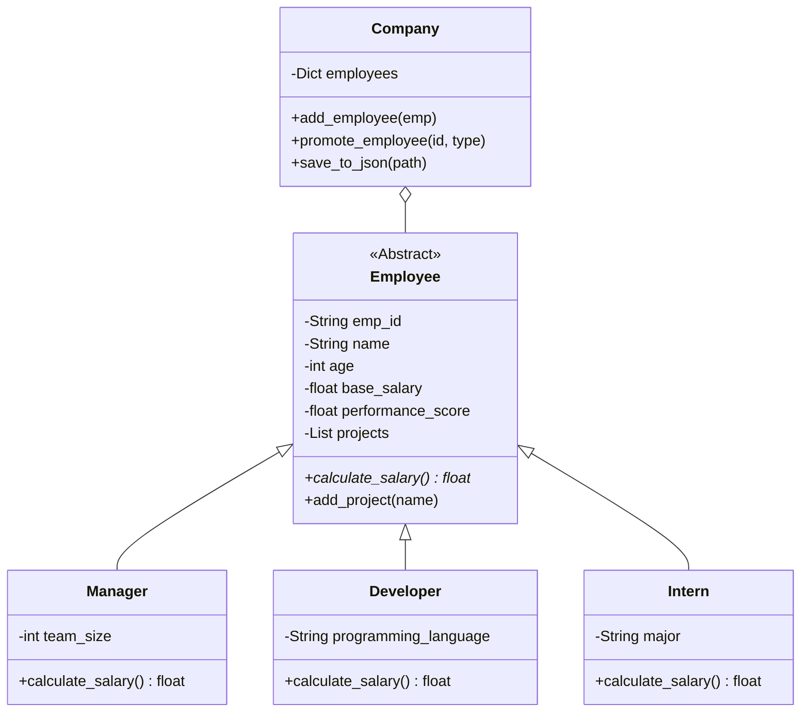

# HỆ THỐNG QUẢN LÝ NHÂN VIÊN CÔNG TY ABC (ENHANCED)

## 📋 MÔ TẢ BÀI TOÁN

Hệ thống quản lý nhân viên (EMS) phiên bản nâng cấp, tích hợp giao diện đồ họa (GUI) hiện đại, hỗ trợ lưu trữ dữ liệu bền vững và các chức năng quản trị nhân sự nâng cao.

---

## 🎯 Các chức năng chính

### 1️⃣ Giao diện người dùng hiện đại (GUI)
- **Dashboard**: Tổng quan số lượng nhân sự theo từng loại.
- **Directory**: Quản lý danh sách nhân viên trực quan với bảng dữ liệu.
- **Forms**: Thêm, sửa, thăng chức và phân công dự án qua các hộp thoại tương tác.

### 2️⃣ Quản lý nhân sự và Hiệu suất
- **Lưu trữ dữ liệu**: Tự động lưu và tải dữ liệu từ file `employees.json`.
- **Thăng chức (Promotion)**: Chuyển đổi trạng thái nhân viên (Intern → Developer → Manager) mà vẫn giữ nguyên điểm hiệu suất và dự án.
- **Tính lương**: Công thức tính lương tự động cập nhật theo chức vụ mới.

---

## 📁 Cấu trúc Project (Cập nhật)

```
employee_management/
│
├── gui_main.py                      # Giao diện đồ họa chính (Khuyên dùng)
├── main.py                          # Giao diện dòng lệnh (CLI)
│
├── data/                            # Thư mục lưu trữ dữ liệu
│   └── employees.json               # Cơ sở dữ liệu JSON
│
├── models/                          # Các lớp định nghĩa (Intern, Developer, Manager)
├── services/                        # Logic xử lý (Company, Payroll)
├── utils/                           # Validators, Formatters
└── exceptions/                      # Ngoại lệ tùy chỉnh
```

---

## 🔧 Hướng dẫn chạy chương trình

### Cách 1: Chạy Giao diện đồ họa (GUI) - Khuyên dùng
```bash
python gui_main.py
```

### Cách 2: Chạy Giao diện dòng lệnh (CLI)
```bash
python main.py
```

---

## 💡 Các tính năng mới tiêu biểu

### 1. Lưu trữ bền vững (Persistence)
Dữ liệu sẽ không bị mất khi đóng chương trình. Mọi thay đổi về nhân sự, điểm số hay dự án đều được ghi lại vào `data/employees.json`.

### 2. Thăng chức chuyên nghiệp
- **Intern → Developer**: Yêu cầu nhập ngôn ngữ lập trình chuyên môn.
- **Developer → Manager**: Yêu cầu nhập quy mô team quản lý.
- Hệ thống tự động chuyển đổi lớp đối tượng (Casting) và áp dụng công thức lương mới ngay lập tức.

### 3. Thống kê thông minh
Giao diện Statistics cung cấp cái nhìn sâu sắc về:
- Điểm hiệu suất trung bình toàn công ty.
- Số lượng nhân viên xuất sắc và nhân viên cần cải thiện.
- Độ tuổi trung bình của lực lượng lao động.

---

## 📊 Cấu trúc Lớp (UML Class Diagram)



---

## 📝 Ghi chú cho Bài tập 1, 2, 3, 9
Dự án này áp dụng các kỹ thuật OOP và phát triển phần mềm chuẩn mực:
- **Kế thừa & Trừu tượng**: Sử dụng lớp cha `Employee` và `ABC` để định nghĩa bộ khung chung.
- **Đa hình**: Phương thức `calculate_salary()` được ghi đè ở mỗi lớp con để xử lý logic riêng.
- **Dependency Management**: Phân tách rõ ràng giữa Model, Service, và UI (CLI/GUI).
- **Type Hinting**: Toàn bộ mã nguồn được chú thích kiểu dữ liệu (Python 3.5+) giúp công cụ lập trình hỗ trợ tốt hơn.
- **Unit Testing**: Hệ thống được kiểm thử tự động qua module `unittest`.

---

**Người thực hiện**: Vi Anh Tuấn  
**Môn học**: Lập trình hướng đối tượng (OOP) – Python
